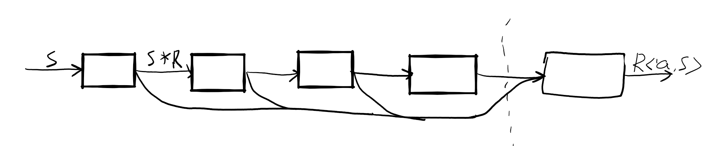
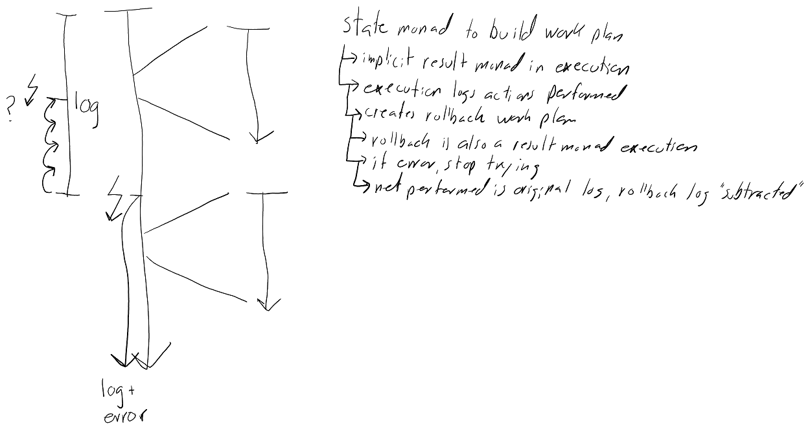

# TFIO
## Actions and rollbacks
Action | To enable rollback | Rollback input | Rollback
--- | --- | --- | ---
open | | stream | close
close | | path | open
create | | path | delete
write | read data to be overwritten | stream, offset, data, file length | seek to write-offset, restore overwritten data from backup, set length to original
write all | | stream | seek to start, set length to zero
read | | | unit
copy | | destination path | delete copy
move | | source and destination path | move back
replace | move destination to backup | backup path, destination path, source path | move back, move backup back
delete | move to backup | backup path, path | restore backup
## Notes

